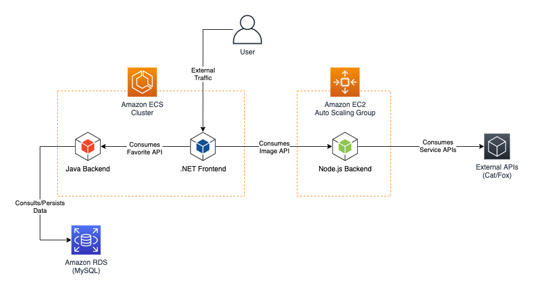
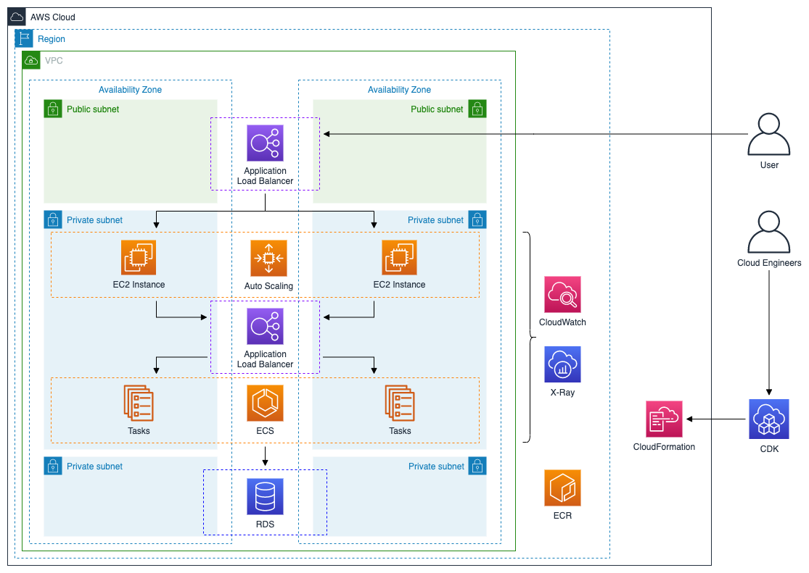

# AWSome Builder PoC Assets

> The content of this repository is not supported by Amazon Web Services (AWS), and is not production-ready.

## About

This repository contains the artifacts used on my internal AWSomeBuilder training. The directory structure represents:

 - `cdk`: AWS CDK code used to deploy the PoC environment.
 - `dotnet-frontend`: Source code for the ASP.NET Core MVC frontend application.
 - `nodejs-backend`: Source code for the Express Node.js backend application.
 - `springboot-backend`: Source code for the Java SpringBoot backend application.
 - `springboot-db-init`: Container definition for the RDS DB Initializer used by Java SpringBoot component.

The application follows this diagram:



## Local Development

To execute this project locally for development, you need:

 - [Docker Engine](https://docs.docker.com/engine/install/)
 - [Docker Compose](https://docs.docker.com/compose/install/)

 Then, you can execute:

 ```bash
git clone https://github.com/davivcgarcia/awesome-builder.git
cd awesome-builder/
docker compose up
```

## Cloud Deployment

To deploy this project into AWS, you need:

 - [AWS Account](https://aws.amazon.com/resources/create-account/)
 - [AWS Command Line Interface (CLI)](https://docs.aws.amazon.com/cli/latest/userguide/install-cliv2.html)
 - [AWS Cloud Development Kit (CDK)](https://docs.aws.amazon.com/cdk/latest/guide/getting_started.html)

Then, you can execute:

```bash
git clone https://github.com/davivcgarcia/awesome-builder.git
cd awesome-builder/cdk
npm install
cdk deploy
```

The infrastructure created will follow this diagram:



## Cloud Cleanup

In order to destroy the deployment, you need to execute:

```bash
cd awesome-builder/cdk
cdk destroy
```

The project was created trying to minimize the ammount of leafovers when deployed in AWS. Due some constraints of the CDK, you still need to manually remove the following resources:

 - Elastic Container Registry for `aws-cdk/assets`
 - CloudWatch Log Groups for `/aws/ecs/containerinsights/`
